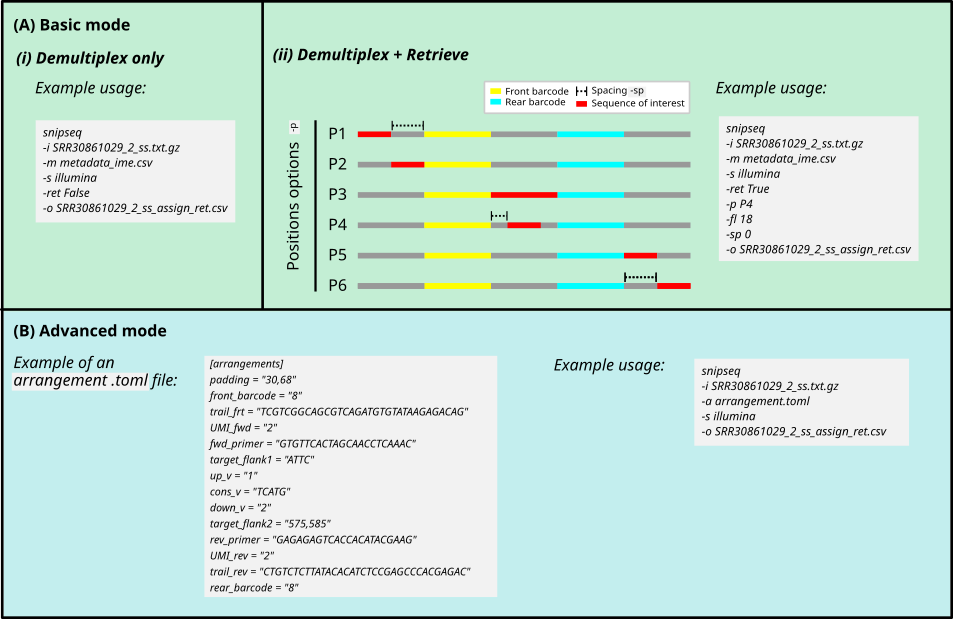

# Snipseq: A Demultiplexing and Sequence Retrieval Tool for User-Defined Barcode

## Key Features
- Flexible Barcode Usage: Accepts user-defined barcode pairs, enabling researchers to repurpose barcodes already available in the lab.
- Compatible with Various Sequencing Services (e.g., Plasmidsaurus) and Platforms: Eliminating the need for custom library prep kits. 
- Mapping, Target Sequence Extraction and Adaptor Trimming: Reduce the need for separate preprocessing steps. 
- Cost-Efficiency: Enables multiplexing of replicates and conditions, allowing pooled sequencing of multiple samples in one run. Users are able to then link each read to its experimental condition via barcode mapping.
- Flexible input files: Accepts `fastq` and `pod5` files as input.

Snipseq is designed to remain accessible even to users with limited bioinformatics experience. At its simplest, only the sequencing reads and a metadata file describing the barcode pairs are required.


## INSTALLATION
```r
git clone https://github.com/gabriellecsw/snipseq.git
cd snipseq
```

## HOW TO START
To accommodate different experimental designs and analysis goals, Snipseq provides two operating modes: `basic` mode and `advanced` mode. 
Both modes support demultiplexing and sequence retrieval, allowing users to choose the level of complexity appropriate for their experiment.



### Basic mode
The `basic` mode is designed for simple experimental setups involving a single feature of interest. In this mode, users may perform demultiplexing alone or demultiplexing with feature sequence retrieval using the `-ret` argument (`False` for demultiplexing only and `True` to demultiplex and retrieve the feature sequence). 

#### Demultiplex only
Below is an example to run snipseq on the basic mode with `ret False`:

```r
snipseq 
-i SRR30861029_2_ss.txt.gz # Your sample file that requires demultiplexing.
-m metadata_ime.csv # A metadata file containing your paired barcode sequences.
-s illumina # The sequencing platform used.
-ret False # Whether to retrieve sequence of interest. The default is False, if True, please refer to next subsection of the basic mode for more information.
-o SRR30861029_2_ss_assign_ret.csv # Your output directory.
```

#### Demultiplex and retrieve sequence of interest
When running the basic mode with `-ret True`, there are several options to choose from depending on the postion of your sequence of interest:


Note that if you are using P1, P4 and P6, you must specify the spacing accordingly using the `sp` parameter. 

Below is an example to run snipseq on the basic mode with `ret True`:

```r
snipseq 
-i SRR30861029_2_ss.txt.gz # Your sample file that requires demultiplexing.
-m metadata_ime.csv # A metadata file containing your paired barcode sequences.
-s illumina # The sequencing platform used.
-ret True # Whether to retrieve sequence of interest.
-p P4 # The position of your sequence of interest on your sequenced fragement.
-fl 18 # The length of your sequence of interest.
-sp 0 # See notes above for sp.
-o SRR30861029_2_ss_assign_ret.csv # Your output directory
```

### Advance mode
The `advanced` mode is intended for more complex experiments involving multiple features or more elaborate read architectures. 
In this mode, `Snipseq` automatically performs both demultiplexing and sequence retrieval.

#### Preparing the `.toml` arrangement file
This `.toml` arrangement file contains the arrangement of specific fewith the read structure and feature locations specified in a .

```r
snipseq 
-i SRR30861029_2_ss.txt.gz # Your sample file that requires demultiplexing
-a arrangement.toml # A .toml file containing the arrangement of features you would like to extract
-s illumina # The sequencing platform used.
-o SRR30861029_2_ss_assign_ret.csv # Output directory
```
#### Input files