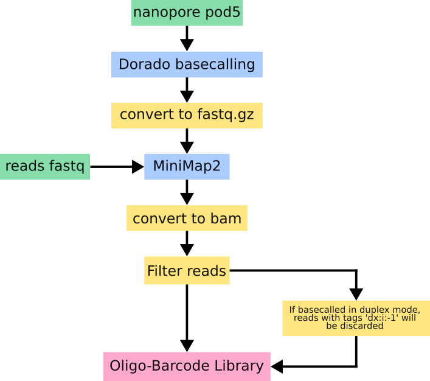

# SnipseqMatch
## Pipeline Flowchart


- **Green** objects represent files and information provided to the pipeline, which are directly passed to a script or program.
- **Blue** objects represent calls to the modules mentioned above.
- **Yellow** objects denote scripts specifically designed for the pipeline.
- **Pink** objects represents the output from this pipeline.

### Pipeline Description
- The process begins with either raw sequencing files or fastq files as input. 
- If starting with pod5 files, snipseq uses dorado basecalling and users can choose either basecalling in simplex or duplex mode. Snipseq will then convert the bam file into a fastq file. 
- If starting with a fastq file, snipseq will start mapping the reads using miniMap2.
- The resulting sam file from miniMap2 will be converted into a bam file using samtools.
- Next, the reads are filtered such that the non-primary and supplementary alignments are discarded.
- If users carried out dorado duplex basecalling, reads with tags ```dx:i:-1``` will be removed because those are duplicates.
- The output is then exported as a fastq file. This file is known as the Oligo-Barcode Library and will be directed to the snipseqAssign pipeline.
